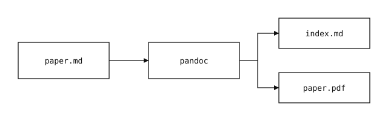

---
# GENERATED by scripts/build-paper.sh from papers/paper-layout-fixture/paper.md.
# Do not edit; change the source and rebuild.
# LAYOUT FIXTURE. Draft only: never published (hugo builds without -D).
# Exercises every part of layouts/research/single.html and the PDF build.
# Build with: scripts/build-paper.sh paper-layout-fixture
title: "Paper Layout Fixture"
subtitle: "A draft page that exercises every element of the research paper template"
date: 2026-10-03
version: "0.1"
status: working-paper
draft: true
authors:
  - given: Andrew P
    family: Hunter
    orcid: 0009-0005-7613-8019
    affiliation: Plainsight Systems
abstract: |
  This page is a layout fixture, not a paper. It exists so the research
  paper template can be checked in a browser: the header, the action row,
  the abstract, the contents rail, headings at two levels, a table, a
  code block, a block quote, and footnotes. It is marked as a draft, so
  production builds never include it.
keywords: [layout, fixture]
pdf: paper-layout-fixture.pdf
---

## 1 Introduction

The body column holds the reading measure at 44rem and starts on the same left edge as the navigation. Long paragraphs should wrap comfortably at this width on a desktop screen and reflow without horizontal scrolling on a phone. This sentence is here to make the paragraph long enough to show three or more lines of text at the widest breakpoint.

A second paragraph checks spacing between paragraphs, carries a footnote marker,[^1] points ahead to [Figure 1](#fig:pipeline), [Table 1](#tbl:elements), [Eq. (1)](#eq:kl) and [Section 4](#sec:results), and cites two sources so the bibliography is exercised: the source coding theorem ([Shannon 1948](#ref-shannon1948)), and usable information under computational constraints ([Xu et al. 2020](#ref-xu2020)).

## 2 Background

### 2.1 A third-level heading

Third-level headings appear indented in the contents rail. The rail is sticky on wide screens and drops above the body as a plain list below 1024px.

> A block quote, set off from the body by a rule on its left.

### 2.2 A table

Table 1. Elements of the template and where each renders.

| Element    | Where it renders         | Checked by          |
|------------|--------------------------|---------------------|
| Action row | Page header              | Download, Cite, DOI |
| Contents   | Right rail or above body | Viewport width      |
| Footnotes  | End of body              | Back-links          |

## 3 Method

A code block checks monospace setting and horizontal overflow:

    scripts/build-paper.sh paper-layout-fixture   # resolves citations, renders the PDF

Inline code such as `index.md` should sit in the line without changing its height.

## 4 Results {#sec:results}

Inline math sits in the line: the entropy of a source is \(H(X) = -\sum_x p(x) \log_2 p(x)\), measured in bits. Dollar signs are never math, so a salary of $431K and a budget of $10 stay literal.

Display math is centered and scrolls sideways on narrow screens rather than overflowing:

\[
\mathbb{E}_{x \sim p}\left[-\log q(x)\right] = H(p) + D_{\mathrm{KL}}(p \,\|\, q)
\tag{1}\]

A wide equation checks the horizontal scroll:

\[
\mathcal{L}(\theta) = \underbrace{H(X)}_{\text{source}} + \underbrace{\varepsilon_{\text{approx}}}_{\text{expression}} + \underbrace{\varepsilon_{\text{est}}}_{\text{data}} + \underbrace{\varepsilon_{\text{opt}}}_{\text{compute}} + \underbrace{\varepsilon_{\text{other}}}_{\text{everything else}}
\]

A standalone image becomes a numbered figure captioned by its alt text:

## 5 Conclusion

The fixture ends here. Its footnote follows.[^2]

## References {#references .unnumbered}

Shannon, Claude E. 1948. “A Mathematical Theory of Communication.” *Bell System Technical Journal* 27 (3): 379–423. <https://doi.org/10.1002/j.1538-7305.1948.tb01338.x>.

Xu, Yilun, Shengjia Zhao, Jiaming Song, Russell Stewart, and Stefano Ermon. 2020. “A Theory of Usable Information Under Computational Constraints.” *International Conference on Learning Representations*.

[^1]: Footnotes render as endnotes, set smaller, with a link back to their marker.

[^2]: A second footnote checks numbering.
